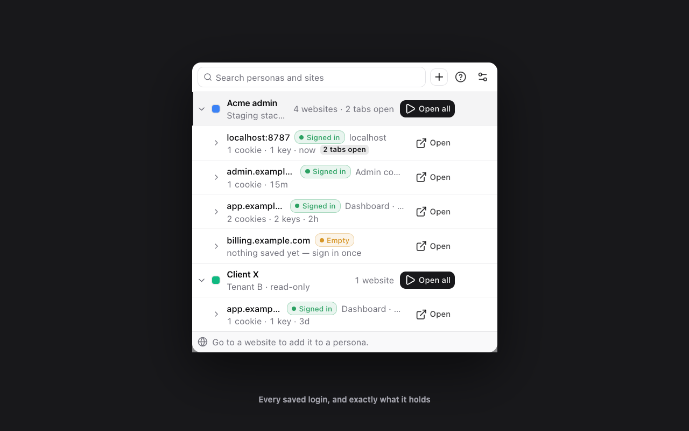
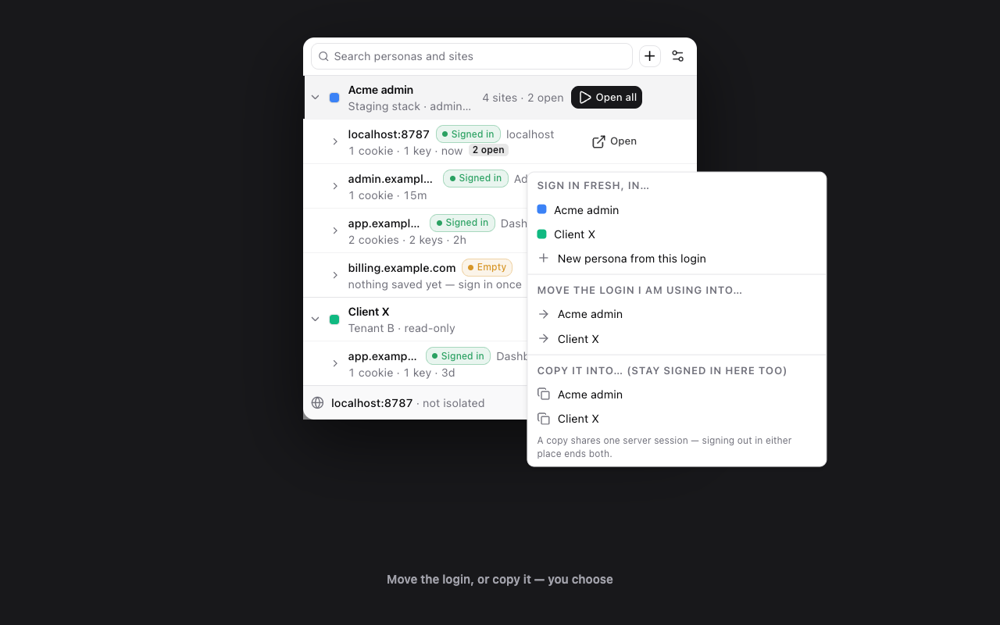
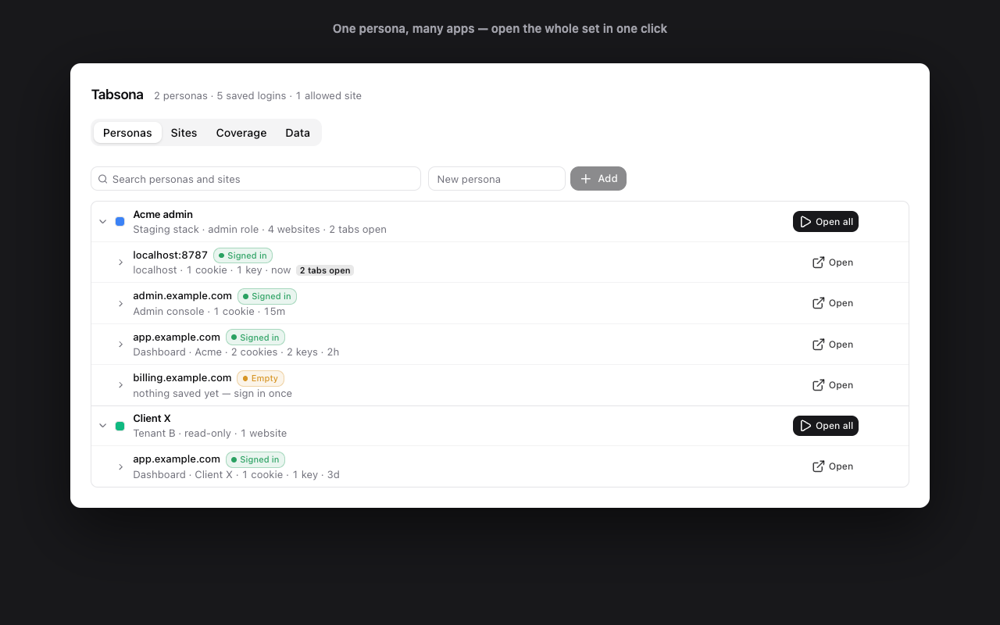
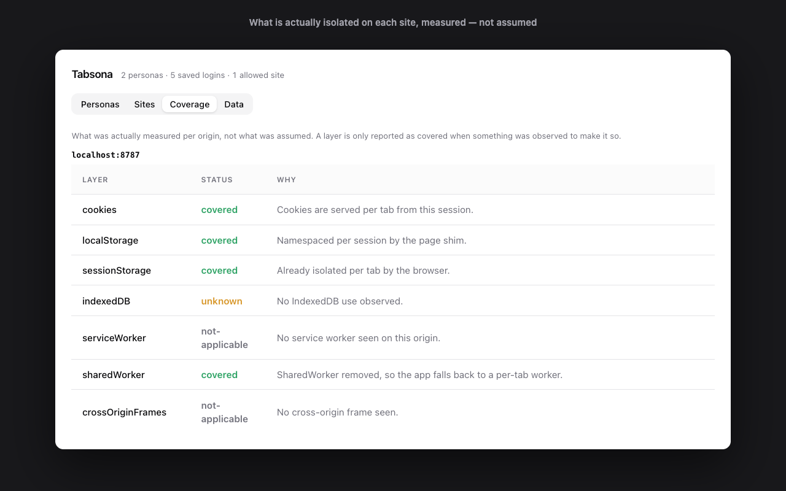
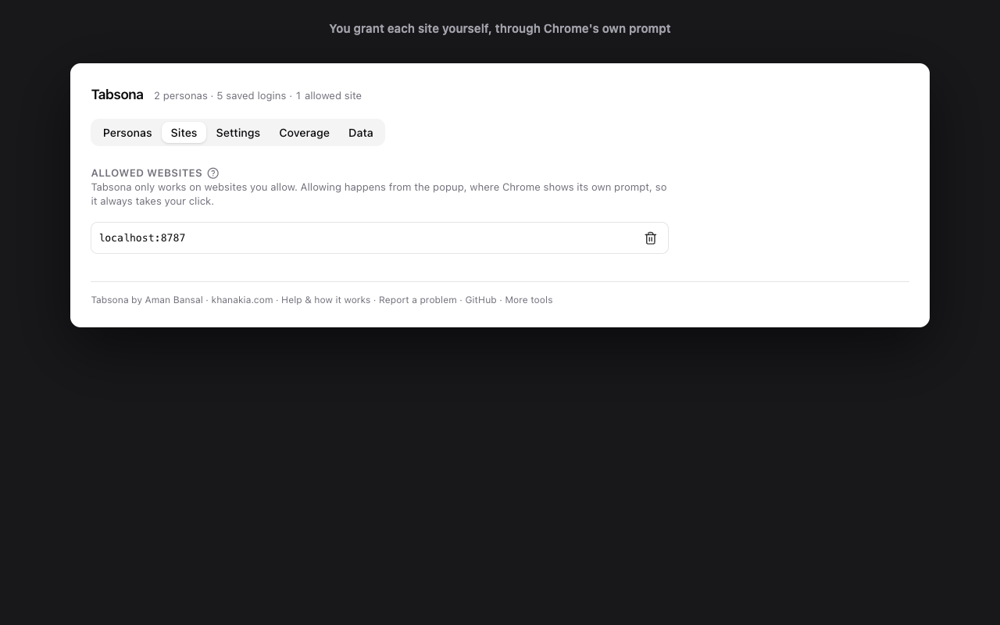

<div align="center">


# Tabsona

**One Chrome window, many logins.**

Give each tab its own login session. Save, open and reuse a whole set of signed-in sites as a *persona* — admin, tenant-A, staging — instead of juggling browser profiles.

[](LICENSE)
[](https://developer.chrome.com/docs/extensions/mv3/intro/)
[](https://www.typescriptlang.org/)
[](#verify-it-yourself)

[How it works](docs/how-it-works.md) · [Limits](docs/limits.md) · [Privacy](https://khanakia.github.io/tabsona/privacy.html) · [Contributing](CONTRIBUTING.md) · [Security](SECURITY.md)



</div>

---

## The problem

You maintain several apps, each with several roles — admin, staff, customer, tenant-A, tenant-B. Testing them means six Chrome profiles, six windows, or six browsers. Switching costs a context switch every time.

Existing multi-login extensions mostly isolate **cookies only**, so the moment an app keeps its token in `localStorage` — which most modern apps do — both tabs show the same user and nothing says why.

## What this does

```
Acme admin                  3 sites  ▶ Open all
  sync.localhost   ● Signed in   4 cookies · 3 keys · 2h
  localhost:8080   ● Signed in   1 cookie · 4h
  stripe.com       ○ Empty       nothing saved yet — sign in once

Client X                    1 site   ▶ Open all
  sync.localhost   ● Signed in   4 cookies · 3d
```

One click on **Open all** and the whole scenario opens: three tabs, three apps, the right identity in each, grouped in a native Chrome tab group. Tabs you open one at a time join that same group; switch off **Open tabs in a tab group** in Settings to open them individually.

### Screenshots

Every image is captured from the real built extension by `task screenshots`, so they cannot drift from the product.

| | |
|---|---|
|  |  |
| **Move or copy — your choice.** File the login you are already using into a persona, or start a fresh one and leave your browser alone. | **The full library.** Every persona, every saved login, and what each one holds. |
|  |  |
| **Measured, not assumed.** Which layers are actually isolated on each site, from what the engine observed. | **You grant every site.** Nothing is touched until you allow it through Chrome's own prompt. |

## Install

```bash
task install
task build            # -> apps/extension/dist
```

In Chrome: `chrome://extensions` → **Developer mode** → **Load unpacked** → pick `apps/extension/dist`.

> Not on the Chrome Web Store yet. Load unpacked for now.

To build an upload for the Store instead:
```bash
task package          # build, validate, then dist/tabsona-<version>.zip
```
`task preflight` runs inside it and refuses to produce a zip if anything would fail Store review — a development host permission in the manifest, an over-length field, an icon whose real size disagrees with its declared size, remotely hosted code, and so on.

## Getting started

1. Open your app and sign in normally.
2. Give Tabsona access: on the welcome page that opens on install, **Allow on all sites** (one Chrome prompt for every website), or **I'll choose sites myself** and then, in the popup on your app, **Allow this website** → confirm in Chrome's dialog. Nothing can be isolated until you do; that is Chrome's security model, not a step that can be skipped for you. See [Site access](#site-access) for the trade-off.
3. **+** → type a persona name → <kbd>Enter</kbd>.
4. **Add to persona** → **Move my login** → your persona.
5. Sign in as the next role and file it into a second persona.
6. **Open all** on either persona brings its whole set back.

### The four ways to build a session

| You want | Do this | Your browser's own login |
|---|---|---|
| A session from scratch | **+** on a persona → type a URL | untouched |
| Use the tab you are on, sign in fresh | **Add to persona** → *Use this tab, signed out* | untouched |
| Keep the login you are already using | **Add to persona** → *Move my login* | removed |
| Keep it in both places | **Add to persona** → *Copy my login* | kept |

**Add to persona** asks *how* first and *which persona* second, so what a choice does to your normal login is on screen before any persona can be clicked. A **copy** leaves one server-side session shared between your browser and the persona, so signing out in either place ends both; the panel says so where the choice is made.

Every button explains itself: rest the pointer on it, or tab to it, and a card says what will happen and what it leaves alone. The **?** in the popup header shows the three-step guide, which also appears on its own until your first persona exists.

### Two accounts on the same site

A persona holds at most one login per site — that is what makes *Open all* unambiguous. Two accounts means two personas, and you never build that by hand:

- **Another account** (footer) lists every persona that does not yet hold this site, plus *In a new persona*.
- **Add another account** (session menu) creates a new persona named after the site, signed out and ready.

### Keyboard

`/` search · `↑↓` move · `→←` expand · <kbd>Enter</kbd> open · <kbd>⌘Enter</kbd> open in this tab · <kbd>Esc</kbd> clear.

### Options page

The full library: every persona and session, allowed sites, a per-origin coverage report, settings, and export/import.

## Why not just…

| | Isolates `localStorage` | Saves & restores sessions | Says when it cannot isolate | Stays in one window |
|---|---|---|---|---|
| **Tabsona** | ✅ | ✅ | ✅ | ✅ |
| Chrome profiles | ✅ | ✅ | n/a | ❌ separate windows |
| Incognito | ✅ | ❌ gone on close | n/a | ❌ one extra identity |
| Cookie-swapping extensions | ❌ | ❌ | ❌ | ✅ |
| Anti-detect browsers | ✅ | ✅ | n/a | ❌ a separate browser |

The column that matters most is the third. Isolation is not all-or-nothing: a service worker, an IndexedDB token or a cross-origin frame can defeat it on a given site. This extension measures what it actually achieved and **shows it on the tab**, rather than letting you assume.

## How it works, briefly

Reading and writing cookies are **different Chrome APIs**, and neither can do the other's job:

- **Write** — `declarativeNetRequest` session rules replace the whole `Cookie` header per tab and per host (`tabIds` conditions work only on session rules), so a persona's cookies reach only the hosts that set them, and strip `Set-Cookie` from responses so your browser's own jar never learns the login.
- **Read** — observational `webRequest` with `extraHeaders` still delivers the raw `Set-Cookie`, **HttpOnly included**, tagged with the exact tab. Manifest V3 removed *blocking* webRequest; observation survived.
- **Storage** — a MAIN-world script at `document_start` namespaces `localStorage` by **session id**, not by tab. That single choice is what makes save and restore possible.

No `chrome.debugger`, so no "being debugged" bar and DevTools keeps working.

**[Read the full explanation →](docs/how-it-works.md)** — with diagrams, the exact matching rules, and live output from a real run.

## Site access

The manifest declares no host permissions; `*://*/*` is only *optional*, so Tabsona can touch no website until you grant it through Chrome's own prompt. Two ways, asked once on the welcome page and changeable any time in **Settings → Websites**:

- **Allow on all sites.** One prompt covers every website. A persona whose app signs in through other hosts (WorkOS, Auth0, Google) is separated end to end, with no prompt per host. The trade-off: a persona tab never sends your normal browser login to *any* website, so a Google or GitHub page it goes to starts signed out in that tab. Tabs outside a persona are not changed. Chrome describes it as "read and change all your data on all websites"; Tabsona sends nothing anywhere.
- **Choose sites yourself.** Allow each website from the popup (**Allow this website**) or **Library → Sites → Allow a website**. When a persona tab is about to visit a website you have not allowed, it **stops before anything is sent** and shows a page right in that tab: "*app* signs you in through *host*" with **Allow and continue** (one click, straight on to where it was going; a sign-in chain you have seen before is one prompt for all its websites), **Open in a normal tab**, or **Allow on all sites**. A login that still slipped through is never saved: the persona is marked, with **Start over signed out**.

Removing **Allow on all sites** keeps every website you allowed one by one.

## Verify it yourself

```bash
task check
```

A full-history secret scan, type-check, 435 unit tests, 28 script tests, the Chrome Web Store preflight, a build, and thirteen end-to-end suites driving the **built extension** in a real Chrome.

| Task | Proves |
|---|---|
| `e2e:isolation` | two personas at once · storage isolated · save → wipe origin → restore · badge honest |
| `e2e:persona` | opening a persona opens every site with its own identity, in one named tab group · single opens join it · setting off leaves tabs ungrouped |
| `e2e:capture` | copying an ordinary tab's login leaves the browser's own jar alone |
| `e2e:move` | moving a login empties the browser's jar |
| `e2e:flows` | all four ways to build a session, and what each does to a plain tab, and to its tab group |
| `e2e:twologins` | a second persona takes a fresh session for a site another already holds |
| `e2e:tabs` | open-in-this-tab moves every layer · a blank new tab never joins a persona |
| `e2e:boot` | concurrent worker boots never duplicate a content script |
| `e2e:migrate` | upgrading from older data keeps every login and boots clean |
| `e2e:cookieonly` | a cookie-only app that redirects signed-out users opens signed in · its cookie reaches no other host |
| `e2e:signin` | with only the app allowed, a sign-in through a chain of providers is stopped by the gate before it leaves (gate page, refused/declined continue, open in a normal tab, link to another host, unbound tab untouched, remembered chain, resume) and a leaked login is never saved · whole chain allowed, each persona signs in as its own user · a forgotten login's open tab is released and re-adding the site opens signed out · with only **Allow on all sites** granted, a persona opens signed out, signs in as its own user, and no alert or host prompt appears |
| `e2e:storage` | two personas on one origin stay apart on a cookie, a localStorage and an IndexedDB login, each against a plain-tab control |
| `e2e:badge` | the in-page badge: bottom-left by default, click shrinks, drag moves it per site and survives reload, double-click resets · the title carries the persona colour and follows a recolour · the tab group recolours · a plain tab gets neither |

Every suite that claims isolation also runs a **control** with no extension, and asserts the tabs *do* collide — without it, a pass could just mean the fixture never shared state.

Against one of your own apps:

```bash
export SYNC_USER1=you@example.test SYNC_PASS1=...
export SYNC_USER2=other@example.test SYNC_PASS2=...
APP_ORIGIN=https://your.app task e2e:app
```

Not sure where an app keeps its login? Measure instead of guessing:

```bash
APP_URL=https://your.app APP_USER=you@example.test APP_PASS=... task probe:app
```

## Known limits

Surfaced on the badge rather than hidden. The complete list, each entry marked verified-in-code or merely assumed, is in [`docs/limits.md`](docs/limits.md).

- **Service-worker fetches bypass isolation.** They carry no tab id, so no per-tab rule matches. Unfixable in the extension model.
- **IndexedDB inside workers is shared.** The page's own databases are kept per persona; a worker's are not, and the badge says so when a page starts one.
- **Partitioned cookies (CHIPS) are not captured** — the partition key is modelled but never populated.
- **Cross-origin iframes** cannot learn which session they belong to.
- **`SharedWorker` is removed** on isolated sites, because it re-syncs login state across tabs behind every other guard. Blunt; being made per-site.

## FAQ

<details>
<summary><strong>Does this touch my normal browsing?</strong></summary>

No. A tab that is not in a persona behaves exactly like an ordinary tab — the storage shim returns immediately when there is no session marker, so the extension's presence is not observable on ordinary pages. The only exception is a login you explicitly **move** into a persona, which is removed from your browser's jar by design.

</details>

<details>
<summary><strong>Why does a new persona start signed out?</strong></summary>

Because it has no credentials yet. If it inherited your existing login, nothing would be isolated. Sign in once and it is saved there; after that, opening it signs you straight in. The row says `Empty · nothing saved yet — sign in once` so this is not a surprise.

</details>

<details>
<summary><strong>Is my login sent anywhere?</strong></summary>

No. Everything lives in `chrome.storage.local` on your machine. There is no server, no telemetry, no sync. An **export file contains live credentials in plain text** — treat it like a password file.

</details>

<details>
<summary><strong>Can I use this to run many accounts on a site that forbids it?</strong></summary>

Technically it will isolate the logins, but every persona shares your browser's fingerprint — canvas, WebGL, fonts, timezone — and most platforms cross-reference those. This is a developer tool for testing your own applications. Fingerprint spoofing, proxy-per-session and ban evasion are out of scope by design.

</details>

<details>
<summary><strong>Why not just use Chrome profiles?</strong></summary>

Profiles isolate perfectly — in separate windows. This keeps everything in one window, lets you open a whole scenario in one click, and survives a tab closing. If you are happy with six windows, profiles are a fine answer.

</details>

<details>
<summary><strong>Does it work on Firefox or Safari?</strong></summary>

Not yet. Firefox has a first-class containers API and deserves a different engine; Safari's `declarativeNetRequest` cannot modify the `Cookie` header at all.

</details>

<details>
<summary><strong>How do I know it is really isolating?</strong></summary>

Don't take it on trust — the badge on each tab reports which layers it actually achieved on that origin, and the Coverage tab in Options explains each one. The badge sits bottom-right by default: click it to shrink it to a dot, drag it anywhere (remembered per site), double-click to put it back. The popup's ⚙ button opens Settings, where you choose the corner, show it as a name or a dot, hide it after a few seconds, or switch it off. Each tab's title also starts with the persona's colour (`💙 Dashboard`), and every persona's colour can be changed from its Rename & describe panel. Then run `task check`, which proves it end to end against a real Chrome, including control runs that demonstrate collision without the extension.

</details>

## Project layout

| Path | What |
|---|---|
| `apps/extension/src/domain` | the vocabulary — zero imports |
| `apps/extension/src/core` | pure logic, unit-tested with no mocks |
| `apps/extension/src/engine` | the `chrome.*` adapters |
| `apps/extension/src/features` | presenters, one folder each |
| `apps/extension/src/surfaces` | popup and options pages |
| `spike/` | end-to-end drivers and the two-role fixture app |
| `docs/` | public documentation |

## Contributing

See [CONTRIBUTING.md](CONTRIBUTING.md). The two rules the project is built around: nothing counts as isolated until it has been demonstrated **failing**, and degradation is **reported, never hidden**.

## License

[Apache-2.0](LICENSE) © Aman Bansal
