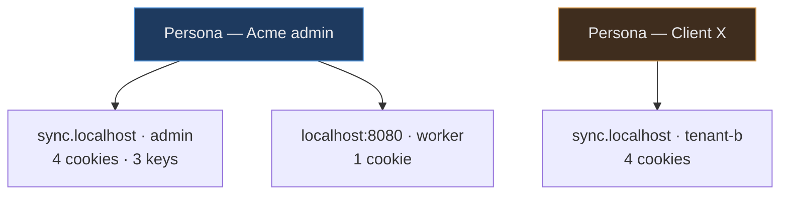
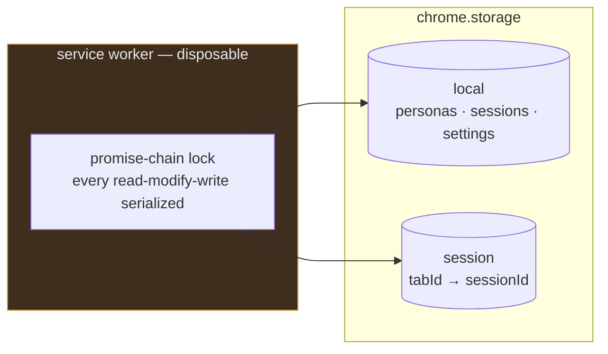
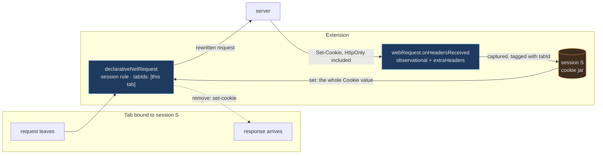
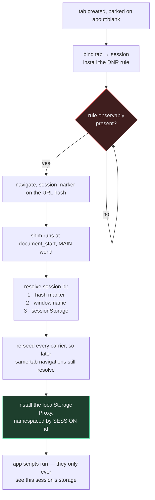
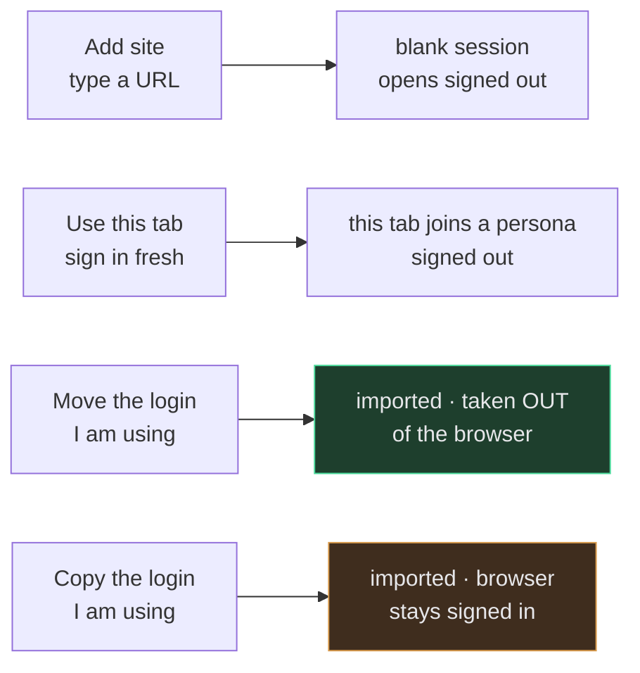
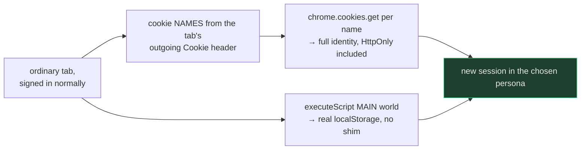
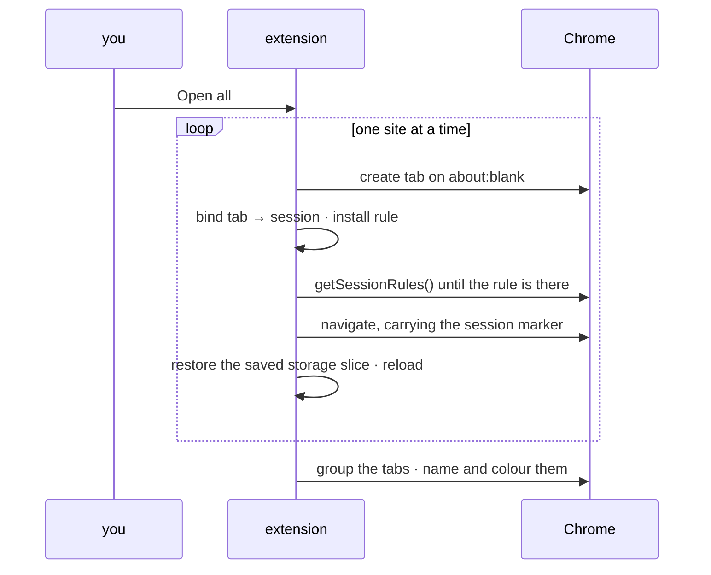
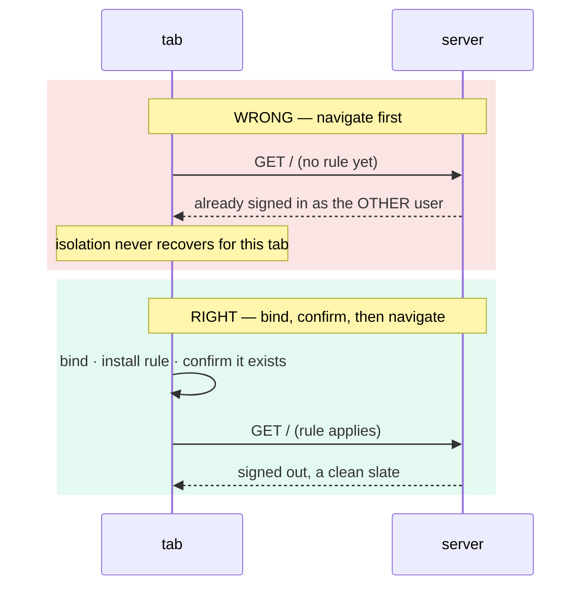

# How it works

Everything MultiSession Tabs does, end to end: the model, the mechanism, the exact Chrome APIs, and the limits. Written so you can decide whether to trust it with a login before you install it.

## Contents

- [The one-paragraph version](#the-one-paragraph-version)
- [The model](#the-model)
- [Cookies: two different APIs](#cookies-two-different-apis)
- [Page storage: the key carries the session](#page-storage-the-key-carries-the-session)
- [The four ways to build a session](#the-four-ways-to-build-a-session)
- [Opening a persona](#opening-a-persona)
- [Why ordering matters more than anything else](#why-ordering-matters-more-than-anything-else)
- [Honest coverage](#honest-coverage)
- [What it cannot do](#what-it-cannot-do)
- [Architecture](#architecture)
- [How it is verified](#how-it-is-verified)

---

## The one-paragraph version

A **session** is a bag of credentials for one site. A **tab** is bound to exactly one session. Every request leaving a bound tab has its `Cookie` header replaced with that session's cookies, and every `Set-Cookie` coming back is captured into that session and **stripped before the browser's own jar sees it**. Separately, every `localStorage` read and write inside the page is rewritten into a namespace owned by the session. Because both halves key off the **session id** rather than the tab, a session outlives its tab — which is what makes save, restore and duplicate possible at all.

The extension *is* the cookie jar. Chrome's own jar holds nothing for a site you have isolated.

---

## The model



- **Persona** — who you are across a set of apps. The unit you actually think in.
- **Session** — one saved login for one site, inside a persona.

A persona holds **at most one session per site**. Two accounts on the same app means two personas. That constraint is what makes "open this persona" unambiguous — there is never a question of *which* login it means.

### Where state lives



Manifest V3 tears the service worker down whenever it likes, so **nothing lives in its memory**. Tab bindings go in `chrome.storage.session` (a tab id is meaningless after a restart); everything else in `chrome.storage.local`. Every mutation goes through one lock, because two concurrent handlers that each read-then-write will silently lose one of the writes.

---

## Cookies: two different APIs

The single most important fact: **reading and writing cookies are different Chrome APIs, and neither can do the other's job.**



**Write — `declarativeNetRequest`.** One `modifyHeaders` rule per bound tab, `set` on the `cookie` request header, with a `tabIds` condition. Session rules are the only rule class that accepts `tabIds`, so per-tab targeting lives there or nowhere. DNR can set or remove a header; it can **never read one**.

We are not in the loop per request. We hand Chrome a rule up front — *"for tab 502, replace Cookie with this exact string"* — and Chrome's network stack does the replacing. That is still interception; it is declarative rather than procedural, because Manifest V3 deleted the procedural option.

**Read — observational `webRequest`.** `onHeadersReceived`, registered **non-blocking** with `['responseHeaders', 'extraHeaders']`, still delivers the raw `Set-Cookie` string — **HttpOnly included** — tagged with the exact `details.tabId`. MV3 removed *blocking* webRequest; observation survived. This is the half everyone assumes is gone, and without it there is no way to learn a session's cookies short of attaching a debugger.

**Strip — also `declarativeNetRequest`.** The same rule removes `set-cookie` from the response, so a session's login never reaches the browser's own jar. Without it, signing into a session tab also signs your whole browser in, and a plain tab silently becomes whoever the persona just signed in as.

### What this looks like live

With two personas signed in to one site:

```
bindings                { "280914502": "s_yr0mlxr", "280914503": "s_81k0v5v" }

tab 280914502 → request   cookie set "fixture_sid=7c167522…"
              → response  set-cookie remove
tab 280914503 → request   cookie set "fixture_sid=16d07b67…"
              → response  set-cookie remove

browser's own jar for that site    (empty)
```

Same host, different cookie, because the header is replaced **per tab** before it leaves.

### Which cookies go into that string

Not all of them — the session's jar is filtered against the tab's current URL using RFC 6265 rules:

| Rule | Behaviour |
|---|---|
| Domain match | Exact host, or a dot-boundary suffix when `Domain=` was set. A **host-only** cookie never reaches subdomains. |
| Path match | Exact, or a prefix ending at a `/` boundary. `/app` matches `/app/sub`, not `/application`. |
| Expiry | Expired cookies are dropped, with a 30-second grace so a session is never reported usable seconds before it stops working. |
| `Secure` | Withheld from plain HTTP — except on `localhost` and `*.localhost`, which browsers treat as secure contexts. |
| Order | Longest path first, so a specific cookie shadows a general one, as a browser would. |

A cookie's **identity** is `(name, domain, path, partitionKey)`. Treating it as `name=value` would replay cookies onto paths and subdomains they were never scoped to.

---

## Page storage: the key carries the session

Most modern apps keep a token in `localStorage`, not a cookie. A MAIN-world script runs at `document_start`, before any app script, and replaces `window.localStorage` with a `Proxy` that prefixes every key with the session's namespace.

The real store, with two sessions live on one origin:

```
fixture_token                 ← the browser's own (plain, unbound tabs)
s_h4r2d97::fixture_token      ← one session
s_whxmndt::fixture_token      ← the other
```

A page asking for `authmgr.access` is silently reading `s_h4r2d97::authmgr.access`. The other session's data is not hidden from it — it is **not addressable**.

The shim also closes the three channels that re-sync login state across same-origin tabs behind every other guard: it swallows `storage` events whose keys belong to another namespace, namespaces `BroadcastChannel` names, and removes `SharedWorker`.

### How the page knows which namespace

The shim must resolve its session id **synchronously**, before the first app script, and it cannot await a message from the service worker. So the id travels on carriers the page can read instantly:



**The namespace is keyed by session, not by tab.** Every comparable extension stores its namespace in `sessionStorage`, which is per-tab by nature — so the namespace dies with the tab, a restored session gets a fresh one, and the app's tokens are unreachable. That single choice is why nothing else can save and restore a session, and why this can.

---

## The four ways to build a session

Each is a different intention, named after its outcome rather than its plumbing.



| You want | What happens | Your browser's own login |
|---|---|---|
| **Add site** — type a URL | A tab opens inside the persona, signed out | untouched |
| **Use this tab** — sign in fresh | This tab joins the persona with a blank session | untouched |
| **Move** the login you are using | Imported into the persona, then **deleted** from the browser's jar; this tab re-enters the persona and stays signed in | removed |
| **Copy** the login you are using | Imported; the browser keeps it too | kept |

### Why move is the default for importing

A **copy** leaves one server-side session shared between the browser's jar and the persona. Signing out in either place invalidates it everywhere, and the saved persona silently becomes worthless. "I saved this into Acme admin" has to mean it now *lives* there.

Copy is still offered, because sometimes it is exactly what you want — but the menu states the trade-off where the choice is made, not in documentation nobody opens.

### Importing from an ordinary tab



Why names-then-lookup instead of simply enumerating: on Chrome 154 `chrome.cookies.getAll` returns an **empty array for every filter shape** — `{url}`, `{domain}`, `{name}`, `{}`, promise and callback form alike — while `chrome.cookies.get({url, name})` returns the same cookie complete with its `HttpOnly` flag. Verified against a live login with both the `cookies` permission and the host permission granted, and cross-checked with CDP `Network.getCookies`, which did see it. Enumeration is unavailable; lookup by name is not.

---

## Opening a persona



Sequential, not parallel: each tab's rule must be **confirmed** before that tab may navigate. Roughly a second per tab, which is honest rather than fast. Empty sessions open too, signed out — they are the cue to sign in, not an error.

Opened tabs join a native Chrome tab group titled with the persona, so which tabs belong to which identity is visible in Chrome's own tab strip.

---

## Why ordering matters more than anything else

Measured, not theorised: with a fixed sleep instead of confirming the rule, the isolation proof passed **2 runs in 3**.



Two consequences baked into the code:

- **The extension owns tab creation.** A design where you navigate and the extension catches up is a race it will lose some of the time, and intermittent isolation is worse than none — it teaches people not to trust the tool.
- **Moving a tab between sessions bounces through `about:blank`.** Changing only the `#fragment` of the same URL is a same-document navigation: the document is never recreated, the shim never re-runs, and cookies would move while page storage stayed behind.

---

## Honest coverage

Isolation is not all-or-nothing, so the extension reports what it actually achieved, per origin, from observations rather than intentions.

| Layer | Status | Why |
|---|---|---|
| Cookies | covered once one has been seen | per-tab rule, both directions |
| `localStorage` | covered once the shim reports itself installed | MAIN-world Proxy |
| `sessionStorage` | always covered | already per-tab in the browser |
| `SharedWorker` | covered when the shim installed | constructor removed |
| IndexedDB | **leaking** on an origin seen using it | detected, not namespaced |
| Service worker | **leaking** when one is active | its fetches carry no tab id |
| Cross-origin frames | **leaking** when one is present | cannot learn the session |

A layer is reported as covered **only when something was observed to make it so**. Absence of evidence shows as `unknown`, never as success — an optimistic default is exactly how a tool ends up telling you it isolated something it did not.

The tab's badge shows the worst of these, in the page, where it cannot be missed. A tool that *looks* isolated while leaking is worse than no tool: it turns every later bug into a question about whether the tool lied.

---

## What it cannot do

Stated plainly rather than buried. The full list, with each entry marked verified-in-code or merely assumed, is in [`docs/limits.md`](limits.md).

- **Service-worker fetches bypass isolation.** They carry no tab id, so they match no per-tab rule and hit the shared jar. Unfixable inside the extension model — only a debugger-based or native engine could see them.
- **IndexedDB is detected, not isolated.** Apps keeping auth there (some Firebase and Supabase setups) will cross-contaminate.
- **Partitioned cookies (CHIPS) are not captured.** The partition key is part of the model but never populated, so partitions collapse into one record.
- **Cross-origin iframes** cannot learn which session they belong to.
- **`SharedWorker` is removed wholesale** on isolated origins — blunt, and it will break an app that legitimately uses one.
- **Cookies set by `document.cookie` in JavaScript are not captured.** Only network `Set-Cookie` headers are.
- **Browser fingerprint is identical** across personas. This is a developer tool, not an anti-detect browser: fingerprint spoofing, proxy-per-session and ban evasion are out of scope by design.

---

## Architecture

```
src/
  domain/        zero imports — the vocabulary (Persona, Session, CookieRecord, coverage, messages)
  core/          pure logic, tested with NO mocks
                 cookies · namespace · rules · coverage · personas · sessionState
  engine/        the chrome.* adapters
                 repo (storage + lock) · rules-sync · capture · storage · import
                 tabgroups · badge · service · index (worker entry)
  app/           client.ts — the ONE module in the UI layer that names chrome.*
  features/      personas · sessions · capture · sites — a presenter + barrel each
  ui/            design system (from volt-web) + shared bits
  surfaces/      popup · options — thin, both consuming the same presenters
  content/       shim (MAIN world) · badge (ISOLATED world)
```

Each layer may import only the one below it. Two rules are **enforced by a test over the source**, not by good intentions:

- `domain/` imports nothing · `core/` never names a chrome API · exactly one UI module does · presenters never import the client · surfaces never deep-import past a barrel.
- **A presenter's test needs no module mocks at all.** If a test reaches for one, the component is fused to the data layer and gets split. That absence is the proof it is portable — and the popup and options page do render the same components.

The boundary test verifies its own matcher (it asserts that it finds files, that it *does* detect chrome usage in the one file that must have it, and that it ignores the word inside a comment) — because a scanner with a broken matcher makes every absence-check pass vacuously.

---

## How it is verified

`task check` is the gate: type-check, 180 unit tests, a build, and nine end-to-end suites that drive the **built extension** in a real Chrome.

| Suite | Asserts |
|---|---|
| `e2e:isolation` | two personas signed in at once · storage isolated · save → **wipe the origin** → restore · badge honest |
| `e2e:persona` | opening a persona opens every site, each with its own identity, in a named tab group |
| `e2e:capture` | copying an ordinary tab's login works and leaves the browser's own jar alone |
| `e2e:move` | moving a login empties the browser's jar — a fresh un-isolated tab is signed out |
| `e2e:flows` | all four ways to build a session, and what each does to a plain tab |
| `e2e:twologins` | an existing second persona takes a fresh signed-out session for a site another already holds |
| `e2e:tabs` | open-in-this-tab moves every layer · a blank new tab never joins a persona · a link from a session tab does |
| `e2e:boot` | concurrent service-worker boots never duplicate a content script |
| `e2e:migrate` | upgrading from older data keeps every login and boots clean |

Two habits run through all of it:

**Nothing counts as isolated until it has been demonstrated failing.** Every suite that claims isolation also runs a **control** — the same scenario with no extension — and asserts the tabs *do* collide. Without the control, a pass could just mean the fixture never shared state.

**Behaviour over API readings.** The save/restore test wipes the origin's storage between saving and restoring, because `localStorage` persists per origin and a restored tab would otherwise find its old data regardless — which masked a real bug for days. Likewise, "the browser's jar is empty" is checked by opening an un-isolated tab and asking the *server* who it is, never by reading `chrome.cookies.getAll`, which returns `[]` on Chrome 154 whether or not the jar was cleared.
