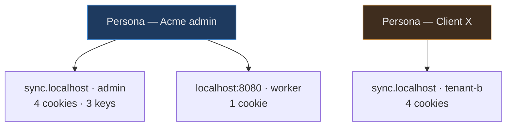
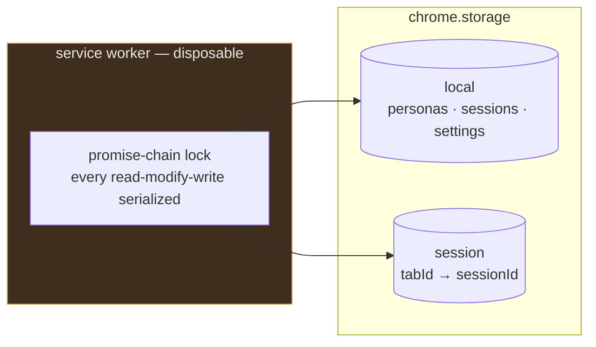
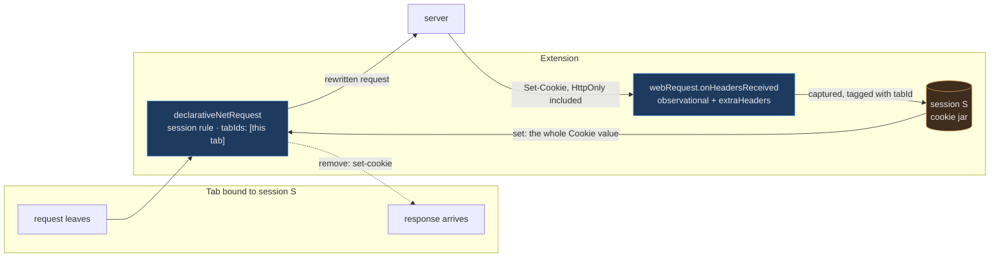
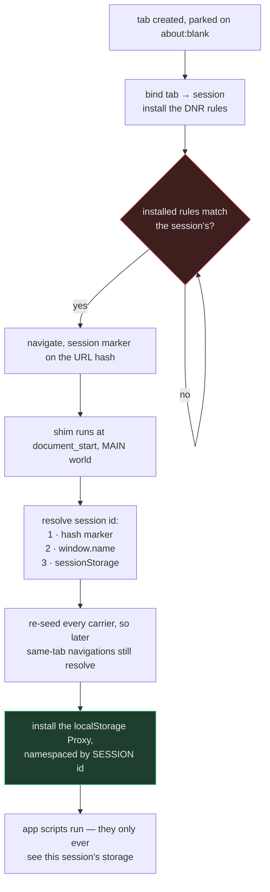
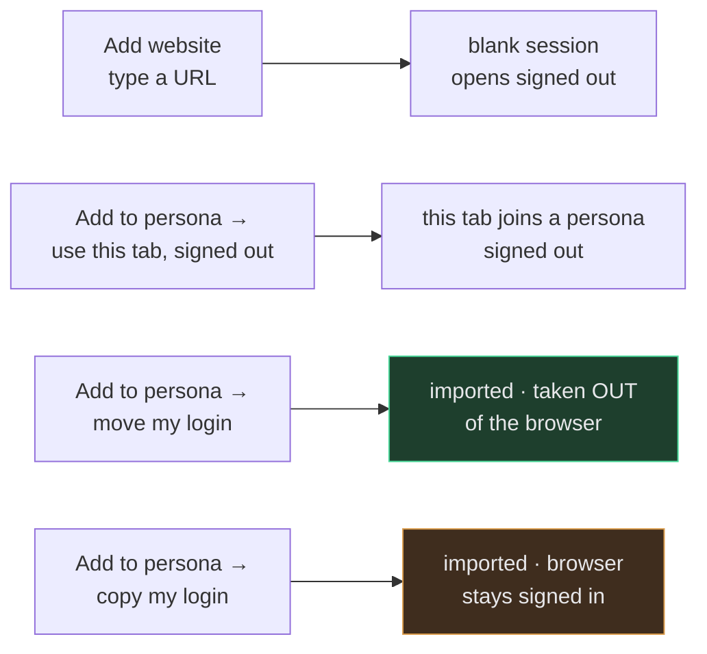
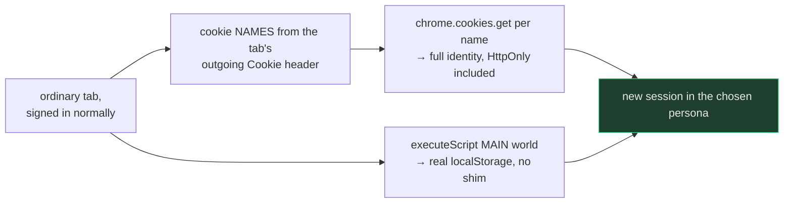
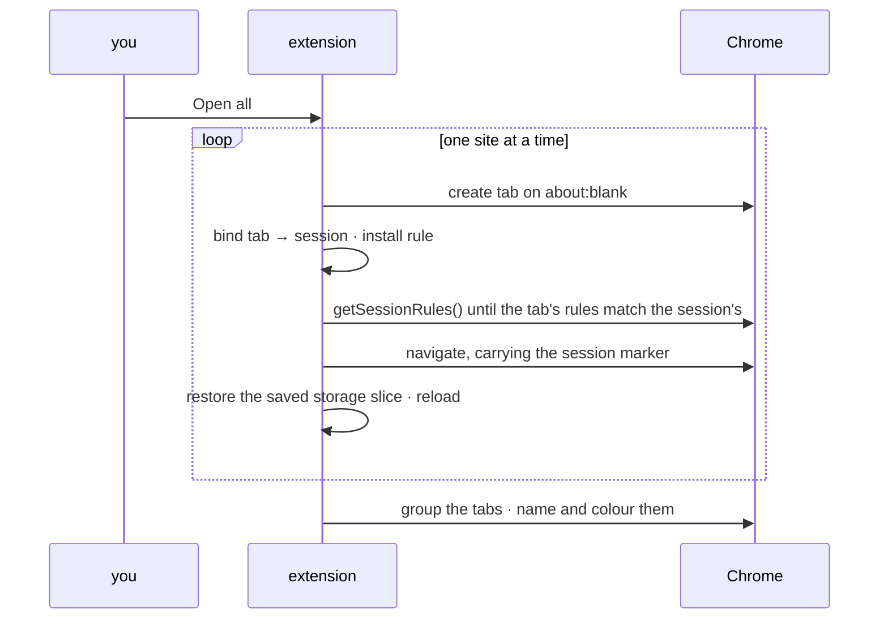
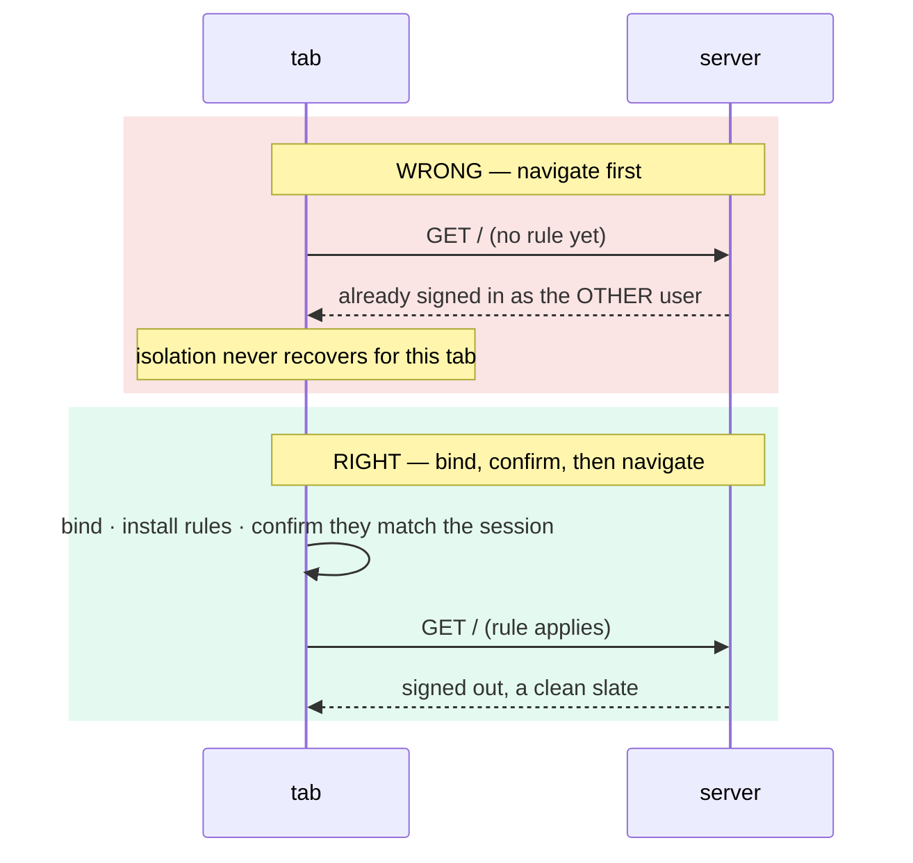

# How it works

Everything Tabsona does, end to end: the model, the mechanism, the exact Chrome APIs, and the limits. Written so you can decide whether to trust it with a login before you install it.

## Contents

- [The one-paragraph version](#the-one-paragraph-version)
- [The model](#the-model)
- [Cookies: two different APIs](#cookies-two-different-apis)
- [Page storage: the key carries the session](#page-storage-the-key-carries-the-session)
- [The four ways to build a session](#the-four-ways-to-build-a-session)
- [The sign-in gate](#the-sign-in-gate-stop-before-the-leak-ask-in-place)
- [Signing in with Google](#signing-in-with-google-and-other-identity-providers)
- [Opening a persona](#opening-a-persona)
- [Why ordering matters more than anything else](#why-ordering-matters-more-than-anything-else)
- [Honest coverage](#honest-coverage)
- [What it cannot do](#what-it-cannot-do)
- [Architecture](#architecture)
- [How it is verified](#how-it-is-verified)

---

## The one-paragraph version

A **session** is a bag of credentials for one site. A **tab** is bound to exactly one session. Every request leaving a bound tab has its `Cookie` header replaced with that session's cookies, and every `Set-Cookie` coming back is captured into that session and **stripped before the browser's own jar sees it**. Separately, every `localStorage` read and write inside the page is rewritten into a namespace owned by the session. Because both halves key off the **session id** rather than the tab, a session outlives its tab — which is what makes save, restore and duplicate possible at all.

The extension *is* the cookie jar. Chrome's own jar holds nothing for a site you have isolated.

---

## The model



- **Persona** — who you are across a set of apps. The unit you actually think in.
- **Session** — one saved login for one site, inside a persona.

A persona holds **at most one session per site**. Two accounts on the same app means two personas. That constraint is what makes "open this persona" unambiguous — there is never a question of *which* login it means.

### Where state lives



Manifest V3 tears the service worker down whenever it likes, so **nothing lives in its memory**. Tab bindings go in `chrome.storage.session` (a tab id is meaningless after a restart); everything else in `chrome.storage.local`. Every mutation goes through one lock, because two concurrent handlers that each read-then-write will silently lose one of the writes.

---

## Cookies: two different APIs

The single most important fact: **reading and writing cookies are different Chrome APIs, and neither can do the other's job.**



**Write — `declarativeNetRequest`.** A small set of `modifyHeaders` session rules per bound tab, each with a `tabIds` condition. Session rules are the only rule class that accepts `tabIds`, so per-tab targeting lives there or nowhere. DNR can set or remove a header; it can **never read one**.

The set is layered by priority. A priority-1 **strip** rule removes `cookie` from every request the tab makes. Above it, one rule per host (and cookie path) the session holds cookies for `set`s the full `Cookie` header for that host, scoped by a `regexFilter` on the request URL. A `Domain=` cookie gets one more rule matching that domain's subdomains. Within one extension a higher-priority rule claims a header and lower ones cannot touch it, so a request to a host the session knows carries exactly that host's cookies, and a request to any other host (analytics, a CDN, an SSO provider) carries none: not the persona's and not the shared jar's.

**Only on hosts Tabsona is allowed on.** Chrome applies a header rule only to a request whose host the extension holds a permission for, and hosts are granted at runtime, one at a time or all at once, so on any host not granted none of this happens and the request carries the browser's own cookies. That matters most for sign-in: an app that sends you to an identity provider on another host (AuthKit, Google, Okta) gets the browser's login there, and the provider sends a fresh persona tab straight back signed in as whoever the browser is. The engine watches for it: when a bound tab's response from an allowed host redirects to a host it is not allowed on, that host is recorded against the **session's site**, never against the host that answered. A sign-in is usually a chain (measured for AuthKit: app → `api.workos.com` → the custom auth domain → `*.authkit.app`), and a redirect seen on a provider's response is still the app's sign-in; filing it under the provider once made the warning vanish after the first host was allowed while the leak went on. Each later hop is only visible once the host before it is allowed, because the extension sees no response from a host it may not touch. The **sign-in gate** (next section) now stops the tab before it leaves; the popup alert below remains the fallback for what the gate cannot catch. The popup gathers these across every open persona tab into a pinned alert and a **Sign-in websites to allow** section with an **Allow all** that requests every listed host in one Chrome prompt; the toolbar icon shows `!` and the badge reports **sign-in through another website** as leaking. Allowing only grants: no tab opens. A grant does not rebuild the rules: they carry no list of hosts, and Chrome checks host access as it matches each request, so an open tab should be covered on its next request; the badges are redrawn on every grant. That runtime path is reasoned from Chrome's documented behaviour, not observed end to end, because a runtime grant needs a human click; the suites pre-grant hosts in the manifest instead. `e2e:signin` reproduces the leak across a two-host chain and the fix.

**Allow on all sites.** The manifest's only host permission is the optional `*://*/*`, so the same pattern can be requested whole: one Chrome prompt, from the first-run welcome on the library page, from **Settings → Websites**, or from a line under the popup's sign-in alert. With it granted every host is covered, so the strip rule removes the browser's cookies from every request a persona tab makes, the sign-in chain included, and no alert can arise. The capture listener's url filter and the content scripts' `matches` are both derived from the live grant set by one pure function (`core/hostAccess.ts`), which collapses an all-sites grant to exactly `*://*/*` (never `<all_urls>`, which names schemes the extension holds no permission for) and both are re-registered on `permissions.onAdded` / `onRemoved`. Whether it is in force is read live from Chrome (`permissions.contains`), never stored; the stored setting is only the user's answer "I'll choose sites myself", so the welcome is not asked twice. The trade-off is shown before the click: a persona tab then sends no browser login to any website, so a Google or GitHub page it reaches starts signed out there. Tabs outside a persona are unchanged. `e2e:signin` phase C grants nothing but `*://*/*` and checks a persona added for the multi-host chain opens signed out, sees the provider's login form, signs in as its own user, and raises no alert, while the plain tab stays signed in.

The rules depend on the session alone, **never on the URL the tab is on**. They once did, and a tab is on `about:blank` when it is bound, so the rule installed before its first real request said "no cookies". An app that redirects signed-out users (any AuthKit or OAuth app) bounced that request to its login page before the corrected rule arrived. The same tab-wide `set` also sent the app's session cookie to every other host the page loaded. `e2e:cookieonly` pins both.

We are not in the loop per request. We hand Chrome rules up front — *"for tab 502, requests to localhost get Cookie: this exact string; everything else gets none"* — and Chrome's network stack does the replacing. That is still interception; it is declarative rather than procedural, because Manifest V3 deleted the procedural option.

**Read — observational `webRequest`.** `onHeadersReceived`, registered **non-blocking** with `['responseHeaders', 'extraHeaders']`, still delivers the raw `Set-Cookie` string — **HttpOnly included** — tagged with the exact `details.tabId`. MV3 removed *blocking* webRequest; observation survived. This is the half everyone assumes is gone, and without it there is no way to learn a session's cookies short of attaching a debugger.

**Strip — also `declarativeNetRequest`.** Every one of the tab's rules removes `set-cookie` from the response, so a session's login never reaches the browser's own jar. Without it, signing into a session tab also signs your whole browser in, and a plain tab silently becomes whoever the persona just signed in as.

### Page cookies: `document.cookie` belongs to the session too

A script's own cookies used to bypass all of this: a write went to the browser's shared jar (visible to every plain tab, and never sent from the persona tab because its `Cookie` header is rebuilt from the session), and a read returned the shared jar. A provider that writes a test cookie from script and from an XHR response, then needs both back (Google's "Cookies are disabled" screen), failed inside every persona.

The MAIN-world shim now owns `document.cookie` in a bound tab. It keeps a copy of the session's page-visible cookies (never the `HttpOnly` ones), mirrored in the origin's real `localStorage` under a key outside the session namespace so the app cannot enumerate it and a read at `document_start` is synchronous. A write is parsed with the browser's own rules (default path is the page's directory, `HttpOnly` cannot be set from script, a foreign `Domain` or a `Secure` cookie from an insecure page is rejected, `core/cookies.ts`), applied to the local copy at once, and sent to the worker through the relay content script (`content/relay.ts`, `document_start`, every frame), which stores it in the session and installs the rule. The worker pushes the session's jar back to every tab bound to it after each capture and when a tab opens.

**The request barrier.** A cookie reaches a request only once its rule is installed (about 15 ms measured), and script can send the next request in microseconds. So inside a persona tab `fetch` and asynchronous XHR wait, before they leave, for the writes still in flight, and for the worker to finish storing whatever a response received in the last 150 ms may have set (`cookieSettle`, answered when no capture is in flight). Never longer than 1.5 s, so a sleeping worker cannot stall a page. What cannot be held: a navigation (a `Set-Cookie` plus `302`, a form submit, `location.href` right after a write) and a synchronous XHR. A redirect's follow-up request is issued by Chrome's network stack with no extension step in between, which is why that case stays in `docs/limits.md` rather than fixed.

### The sign-in gate: stop before the leak, ask in place

A persona tab used to be able to *leave* for a host Tabsona may not touch, carrying the browser's login, and the engine could only notice afterwards. The gate stops it first. For every bound tab (and only bound tabs) the engine installs a session rule `{tabIds:[tab], resourceTypes:['main_frame'], urlFilter:'|http', action:block}` plus one `allow` per granted host, scoped by `regexFilter` to that host's exact scheme and port. A navigation to anywhere else is cancelled before a request leaves, `webNavigation.onErrorOccurred` reports the exact url (a server `302` into the host included), and the worker replaces the tab with the extension's own **gate page**. No gate rule exists while `*://*/*` is granted, so Allow on all sites changes nothing here.

The page names the app, the persona (with its colour) and the host: "*app* signs you in through *host*. Allow Tabsona on *host* so *persona* gets its own login there, otherwise you'd arrive signed in as your normal browser login", or, for a link that is not a known sign-in hop, "This tab is about to visit *host*". **Allow and continue** calls `permissions.request` straight from the click, re-syncs the rules and navigates to the exact blocked url, query included. **Allow on all sites** asks for every website instead. **Open in a normal tab** opens the url in an ordinary, unbound tab (as the browser, which is the point) and puts the persona tab back on the page it was on, so a persona is never turned into an ordinary tab behind the user's back and a refused host never strands it on the gate page. The new tab is ungrouped, because Chrome can place a tab inserted beside a grouped one inside that persona's tab group.

**A stopped form POST is not resumed as a GET.** `onErrorOccurred` reports a blocked navigation's url and nothing else: no method, no body. A form POST to a provider therefore looked like a link, and resuming it sent the provider a GET with every parameter missing (the staging run ended on Google's "Error 400: Required parameter is missing: response_type"). The relay content script (isolated world, `document_start`, every frame, capture phase) tells the worker when a form with method POST is submitted, as target and method only, never the fields; a navigation stopped within 15 seconds at that form's origin and path is recorded as `viaForm`, in either order of arrival. For a `viaForm` stop the page says the form cannot be resent, **Allow and go back** takes the tab back to the page holding the form (`tabs.goBack`, falling back to the last page) so the user presses the button again with the host now allowed, and **Open in a normal tab** is not offered. A GET stop resumes to the byte-identical url. A programmatic `form.submit()` fires no event and is not recognised (see limits).

Every hop of a sign-in is visible only once the host before it is allowed, so asking per hop would stop once per hop. The chain is therefore remembered per site in `chrome.storage.local` (`signInChains`, behind the lock in `engine/repo.ts`, capped per site), and the next persona that opens the site gets one prompt, "signs in through 3 websites · Allow all 3 and continue".

**Never save a leaked login.** If a persona tab still completed a hop through a host Tabsona was not allowed on (a gate rule that failed to install, a `fetch` redirect the gate does not cover), the tab is in a *leak window* for five minutes from the last such hop: cookies and page storage captured from it are dropped rather than saved, the session is marked, the badge and popup say "signed in through an unprotected website", and **Start over signed out** clears that session's cookies and page data for the site and reloads it. A rule keeps the strip, so the dropped cookies never reached the browser's jar either.

**Rule priority layering.** Chrome cancels every `modifyHeaders` rule, and every `block`, of the same or lower priority than a matching `allow`, silently. The gate needs an `allow` per granted host, so it sits *below* everything that edits headers; the pass-through exemption (next section) is an `allow` that is meant to cancel those edits, so it sits *above* everything. The complete order, lowest to highest: `1` gate block, `2` gate allow, `3` the Cookie / Set-Cookie strip, `1,000,000` and up the parent-domain cookie SET rules, `2,000,000` and up the exact-host cookie SET rules, `3,000,000` the pass-through allow. The highest possible cookie rule stays under `3,000,000` by construction (the label and path terms never reach one tier span). Pinned by a unit test (`core/__tests__/passthrough.test.ts`) and proven by the isolation, cookieonly, twologins, and signin suites, which all run with the gate in place.

### Pass-through hosts: use the browser's login on chosen websites

Google cannot sign in from a separate login. It sets its flow cookie (`__Host-GAPS`) on a `302` and expects it back on the redirect's follow-up request; a per-tab rule is installed only after the response is seen, so the follow-up leaves without it (0 of 10 in `spike/probe-redirect-cookie.mjs`, and holding the follow-up with the debugger does not help, because Chrome fixes the rule's header changes before the DevTools pause). Its device-bound session refreshes also run inside the browser, out of reach of any per-tab rule. So the fix is not better isolation but an honest exception: the user lists the websites a persona tab reaches **with the browser's own login**, and everything else stays separate.

The list (`passThroughHosts` in `chrome.storage.local`, written behind the lock in `engine/repo.ts`, empty until the user adds something) holds `host`, `*.host` or `host:port` entries, normalised and capped (`core/passthrough.ts`). For every bound tab the engine installs one tab-scoped `allow` per entry at priority `3,000,000`, matching the request url by `regexFilter` with the same host rules as a Chrome grant (no port means any port, `*.` is the domain and every subdomain, never a look-alike). That single rule does three things at once, with no host permission needed because an `allow` edits nothing: the Cookie strip and any per-host SET rule are cancelled, so the request carries the browser's own `Cookie`; the response's `Set-Cookie` is kept, so it lands in the browser's jar (and a redirect-set cookie reaches the follow-up, because the browser's network stack handles it, not us); and the gate's block is cancelled, so the tab is not stopped on a host Tabsona holds no grant for.

Everything else that would treat such a host as a leak is told it is intended: the capture listener saves no cookie from it and does not file a redirect into it as a sign-in hop, the leak window never opens for it, the sign-in alerts and the popup's "websites to allow" omit it, and the shim and the relay (`excludeMatches` on their registration) do not run there, so `document.cookie`, `localStorage` and IndexedDB are the page's own. The badge script does run: on such a host it says **uses your normal login (your choice)**, in blue, never "isolated" (coverage status `shared`, `core/coverage.ts`).

The Google preset (`accounts.google.com`, `accounts.youtube.com`, the two hosts Google's sign-in walks; deliberately not `*.google.com`, which would hand Gmail and Drive the browser's login too) is **offered, never applied** (the list starts empty; Settings always shows the defaults with their state, and **Restore default sites** re-adds only the missing ones, so a removed default is one click away): the gate page offers "Use my normal Google login here" when it stops a Google host, the popup's sign-in alert offers the same, and Settings → "Use my normal login on" has **Restore default sites** plus a box to add any host (a country domain such as `accounts.google.co.in`). Picking it adds the hosts, re-scopes the content scripts, and resumes the stopped navigation (a form POST goes back to the form, like any gate stop). The trade-off is shown wherever the choice is offered: the website then sees the browser's login, shared with every other tab, so an account added at Google inside a persona is added to the browser too, and the account chooser decides which Google account the persona gets. The app's own session (the cookie the app sets after the OAuth callback) stays per persona, because the app's host is not on the list.

### Signing in with Google (and other identity providers)

This is the whole story of the hardest login to keep separate, in the order it was found, because each step explains a piece of the machinery above.

**1. The first failure was not Google.** Apps such as a Next.js app on WorkOS AuthKit sign in through a chain of websites (the app, `api.workos.com`, the custom auth domain, `*.authkit.app`). Tabsona holds a permission for the app only, and Chrome applies a header rule only on a host the extension may touch, so the hop to the provider carried the browser's own cookies and the provider answered as the browser's user. A fresh persona came back signed in as someone it was never meant to be. Fixing it took four pieces: every hop of the chain is filed under the app's site (not under the responding provider, which hid the alerts after the first Allow); a login that slipped through a hop is never saved into the persona (the leak window); the **gate** stops the tab before it leaves, because a `block` rule works on a host with no permission while a `redirect` does not; and the rule priorities were corrected, since an `allow` silently cancels every header edit of the same or lower priority.

**2. Then Google itself.** With the chain allowed, Google's own screens still failed, in this order. Allowing a host after the gate stopped a form POST resumed it as a GET, and Google answered "Required parameter is missing: response_type": the gate now recognises a stopped form and takes the tab back to the form. Google then said "Cookies are disabled" because it writes a test cookie from script and reads it back, and `document.cookie` was still the browser's: the shim now owns it, with a request barrier so a `fetch` sent right after a write waits for the rule that carries it. That passed a Google-like fixture and still failed on real Google.

**3. The cause, measured.** Google mints its flow cookie (`__Host-GAPS`) on the very first `302` of the sign-in and expects it back on the redirect's follow-up request, tied to the flow id in the redirect url. Tabsona learns a cookie only after the response is seen and then installs a rule, which took 1 to 23 ms; Chrome issues the follow-up immediately, so it leaves without the cookie and Google starts a second, mismatched flow. A probe with a three-hop redirect chain (`spike/probe-redirect-cookie.mjs`) passed 0 of 10 times. Everything that could repair this was tried:

| Approach | Result |
|---|---|
| Per-tab rules, as everywhere else | 0 of 10: the follow-up outruns the rule |
| Hold the follow-up with the debugger until the rule is in | 0 of 10: Chrome fixes a rule's header changes before the debugger's pause, so a rule installed during the pause is too late |
| The debugger writes the `Cookie` header itself, plus a `Set-Cookie` strip rule | 10 of 10 and the browser's jar stays clean, but `debugger` cannot be an optional permission: every user would see "read and change all your data" on install, and a debugging banner while it runs |
| Swap the persona's cookies into the real jar for the sign-in | Works, but leaks both ways (plain tabs send the persona's cookies, the persona sends the browser's), leaves cookies behind because cookies cannot be enumerated, and forbids two persona tabs of one site |

Google's device-bound session refreshes also run inside the browser, out of reach of any per-tab rule, so even a perfect engine could end with the persona's Google session refreshed against the browser's jar.

**4. The choice: stop trying to isolate Google.** Isolation matters for the app's session, not for the identity provider. So the user lists the websites a persona tab reaches with the browser's own login (see above), and everything else stays separate. The trade-off is stated wherever the choice is offered: Google then sees the browser's login, shared with the other tabs, so the account chooser decides which Google account a persona gets. The app's own session, the cookie the app sets after the OAuth callback, stays per persona. This was confirmed on a real Google sign-in through a WorkOS staging app, and the end-to-end suite proves it with a fixture whose redirect sets a cookie (phases P, P2 and P3 of `spike/e2e-signin.mjs`), each guard broken on purpose to watch it fail.

**5. Not done, and why.** A strict mode that keeps Google per persona would need the debugger engine, best shipped as a separate companion extension so the main extension's permissions do not change. It is parked until per-persona Google accounts are a real need. What stays outside every layer is listed in [limits.md](limits.md): a `form.submit()` resume, the `cookieStore` API, synchronous XHR, a cookie set on a redirect for a host that is not on the list, service-worker requests, and subframes.

### What this looks like live

With two personas signed in to one site:

```
bindings                { "280914502": "s_yr0mlxr", "280914503": "s_81k0v5v" }

tab 280914502 → any host          cookie remove · set-cookie remove   (priority 1)
              → localhost, any port cookie set "fixture_sid=7c167522…"   (priority 2001001)
tab 280914503 → any host          cookie remove · set-cookie remove   (priority 1)
              → localhost, any port cookie set "fixture_sid=16d07b67…"   (priority 2001001)

browser's own jar for that site    (empty)
```

Same host, different cookie, because the header is replaced **per tab** before it leaves.

### Which cookies go into that string

Not all of them. For each host and cookie path, the session's jar is filtered using RFC 6265 rules, and each result becomes the header for requests matching that host and path:

| Rule | Behaviour |
|---|---|
| Domain match | Exact host, or a dot-boundary suffix when `Domain=` was set. A **host-only** cookie never reaches subdomains. |
| Path match | Exact, or a prefix ending at a `/` boundary. `/app` matches `/app/sub`, not `/application`. |
| Expiry | Expired cookies are dropped, with a 30-second grace so a session is never reported usable seconds before it stops working. |
| `Secure` | Withheld from plain HTTP — except on `localhost` and `*.localhost`, which browsers treat as secure contexts. |
| Order | Longest path first, so a specific cookie shadows a general one, as a browser would. |

A cookie's **identity** is `(name, domain, path, partitionKey)`. Treating it as `name=value` would replay cookies onto paths and subdomains they were never scoped to.

---

## Page storage: the key carries the session

Most modern apps keep a token in `localStorage`, not a cookie. A MAIN-world script runs at `document_start`, before any app script, and replaces `window.localStorage` with a `Proxy` that prefixes every key with the session's namespace.

The real store, with two sessions live on one origin:

```
fixture_token                 ← the browser's own (plain, unbound tabs)
s_h4r2d97::fixture_token      ← one session
s_whxmndt::fixture_token      ← the other
```

A page asking for `authmgr.access` is silently reading `s_h4r2d97::authmgr.access`. The other session's data is not hidden from it — it is **not addressable**.

The shim also closes the three channels that re-sync login state across same-origin tabs behind every other guard: it swallows `storage` events whose keys belong to another namespace, namespaces `BroadcastChannel` names, and removes `SharedWorker`.

### How the page knows which namespace

The shim must resolve its session id **synchronously**, before the first app script, and it cannot await a message from the service worker. So the id travels on carriers the page can read instantly:



**The namespace is keyed by session, not by tab.** Every comparable extension stores its namespace in `sessionStorage`, which is per-tab by nature — so the namespace dies with the tab, a restored session gets a fresh one, and the app's tokens are unreachable. That single choice is why nothing else can save and restore a session, and why this can.

---

## The four ways to build a session

Each is a different intention, named after its outcome rather than its plumbing.



| You want | What happens | Your browser's own login |
|---|---|---|
| **Add website** — type a URL | A tab opens inside the persona, signed out | untouched |
| **Add to persona → Use this tab, signed out** | This tab joins the persona with a blank session | untouched |
| **Add to persona → Move my login** | Imported into the persona, then **deleted** from the browser's jar; this tab re-enters the persona and stays signed in | removed |
| **Add to persona → Copy my login** | Imported; the browser keeps it too | kept |

### Why move is the default for importing

A **copy** leaves one server-side session shared between the browser's jar and the persona. Signing out in either place invalidates it everywhere, and the saved persona silently becomes worthless. "I saved this into Acme admin" has to mean it now *lives* there.

Copy is still offered, because sometimes it is exactly what you want — but the menu states the trade-off where the choice is made, not in documentation nobody opens.

### Importing from an ordinary tab



Why names-then-lookup instead of simply enumerating: on Chrome 154 `chrome.cookies.getAll` returns an **empty array for every filter shape** — `{url}`, `{domain}`, `{name}`, `{}`, promise and callback form alike — while `chrome.cookies.get({url, name})` returns the same cookie complete with its `HttpOnly` flag. Verified against a live login with both the `cookies` permission and the host permission granted, and cross-checked with CDP `Network.getCookies`, which did see it. Enumeration is unavailable; lookup by name is not.

---

## Opening a persona



Sequential, not parallel: each tab's rules must be **confirmed** before that tab may navigate. Confirmed by content, not by id: an id check once passed on a rule that removed every cookie, and would equally pass on a rule left over from the tab's previous session. Roughly a second per tab, which is honest rather than fast. Empty sessions open too, signed out — they are the cue to sign in, not an error.

Opened tabs join a native Chrome tab group titled with the persona, so which tabs belong to which identity is visible in Chrome's own tab strip. This holds for every way a tab joins a persona — Open all, opening one session, adding a site, another login, using or moving the current tab — and a tab joins the group the persona already has in that window rather than starting a second one (`core/tabgroups.ts` plans it, `engine/tabgroups.ts` carries it out). Copying a login leaves the tab plain, so ungrouped. One setting, **Open tabs in a tab group**, governs all of it: off, tabs open individually. A failure to group never blocks opening and is logged to the worker console rather than swallowed.

---

## Why ordering matters more than anything else

Measured, not theorised: with a fixed sleep instead of confirming the rule, the isolation proof passed **2 runs in 3**.



Two consequences baked into the code:

- **The extension owns tab creation.** A design where you navigate and the extension catches up is a race it will lose some of the time, and intermittent isolation is worse than none — it teaches people not to trust the tool.
- **Moving a tab between sessions bounces through `about:blank`.** Changing only the `#fragment` of the same URL is a same-document navigation: the document is never recreated, the shim never re-runs, and cookies would move while page storage stayed behind.

---

## Honest coverage

Isolation is not all-or-nothing, so the extension reports what it actually achieved, per origin, from observations rather than intentions.

| Layer | Status | Why |
|---|---|---|
| Cookies | covered once one has been seen | per-tab rule, both directions |
| `localStorage` | covered once the shim reports itself installed | MAIN-world Proxy |
| `sessionStorage` | always covered | already per-tab in the browser |
| `SharedWorker` | covered when the shim installed | constructor removed |
| IndexedDB | covered when the shim namespaced it and no worker was seen | database names translated per session; **leaking** if the page starts a worker |
| Service worker | **leaking** when one is active | its fetches carry no tab id |
| Cross-origin frames | **leaking** when one is present | cannot learn the session |
| Sign-in through another website | **leaking** when a redirect to a host Tabsona is not allowed on was seen anywhere in the site's sign-in chain | no header rule applies there, so the browser's own login is used; allowing the host clears it |
| A website on the "use my normal login" list | **shared** (the user's choice) | nothing is kept separate there by design, so no layer is claimed: the badge says "uses your normal login (your choice)", never "isolated", and it is neither a leak nor an alert |

A layer is reported as covered **only when something was observed to make it so**. Absence of evidence shows as `unknown`, never as success — an optimistic default is exactly how a tool ends up telling you it isolated something it did not.

The tab's badge shows the worst of these (a leak, then unknown, then a chosen share), in the page, where it cannot be missed. A tool that *looks* isolated while leaking is worse than no tool: it turns every later bug into a question about whether the tool lied.

---

## What it cannot do

Stated plainly rather than buried. The full list, with each entry marked verified-in-code or merely assumed, is in [`docs/limits.md`](limits.md).

- **Service-worker fetches bypass isolation.** They carry no tab id, so they match no per-tab rule and hit the shared jar. Unfixable inside the extension model — only a debugger-based or native engine could see them.
- **IndexedDB inside workers is shared.** The page's own databases are kept per persona (names translated to `<session>::<name>`), but a dedicated worker or service worker has its own `indexedDB` the shim never runs in. The badge reports the layer as leaking whenever the page starts one.
- **Partitioned cookies (CHIPS) are not captured.** The partition key is part of the model but never populated, so partitions collapse into one record.
- **The sign-in gate stops only top-level navigations.** A persona tab's page navigation to a host Tabsona is not allowed on is stopped and asked about. A sub-frame, a `fetch`/XHR and a service worker's request to such a host are not (blocking them breaks pages for reasons no one could trace); those can still carry the browser's login there, are caught afterwards by the leak window (the login is not saved, the session is marked, **Start over signed out** clears it) and by the popup's alert. **Allow on all sites** removes the gap in one prompt.
- **Cross-origin iframes** cannot learn which session they belong to.
- **`SharedWorker` is removed wholesale** on isolated origins — blunt, and it will break an app that legitimately uses one.
- **`document.cookie` is the persona's, with gaps.** See "Page cookies" under Cookies, and `docs/limits.md`.
- **Browser fingerprint is identical** across personas. This is a developer tool, not an anti-detect browser: fingerprint spoofing, proxy-per-session and ban evasion are out of scope by design.

---

## Architecture

```
src/
  domain/        zero imports — the vocabulary (Persona, Session, CookieRecord, coverage, messages)
  core/          pure logic, tested with NO mocks
                 cookies · namespace · rules · coverage · personas · sessionState · tabgroups · signin
                 gate · hostAccess · passthrough · settings · placement · badgeLook · titleMark · idb
  engine/        the chrome.* adapters
                 repo (storage + lock) · rules-sync · capture · pagecookies · storage · import
                 gate · passthrough · permissions · observations · tabgroups · badge
                 service · index (worker entry)
  app/           client.ts — the ONE module in the UI layer that names chrome.*
  features/      personas · sessions · capture · sites · gate · signin · settings — a presenter + barrel each
  ui/            design system (from volt-web) + shared bits
  surfaces/      popup · options · gate — thin, consuming the same presenters
  content/       shim (MAIN world) · relay (ISOLATED, document_start) · badge (ISOLATED)
```

Each layer may import only the one below it. Two rules are **enforced by a test over the source**, not by good intentions:

- `domain/` imports nothing · `core/` never names a chrome API · exactly one UI module does · presenters never import the client · surfaces never deep-import past a barrel.
- **A presenter's test needs no module mocks at all.** If a test reaches for one, the component is fused to the data layer and gets split. That absence is the proof it is portable — and the popup and options page do render the same components.

The boundary test verifies its own matcher (it asserts that it finds files, that it *does* detect chrome usage in the one file that must have it, and that it ignores the word inside a comment) — because a scanner with a broken matcher makes every absence-check pass vacuously.

---

## How it is verified

`task check` is the gate: type-check, 488 unit tests, a build, and thirteen end-to-end suites that drive the **built extension** in a real Chrome.

| Suite | Asserts |
|---|---|
| `e2e:isolation` | two personas signed in at once · storage isolated · save → **wipe the origin** → restore · badge honest |
| `e2e:persona` | opening a persona opens every site, each with its own identity, in one named tab group · a single added site joins that group, a second joins the same one · with the setting off, a tab opens ungrouped |
| `e2e:capture` | copying an ordinary tab's login works and leaves the browser's own jar alone |
| `e2e:move` | moving a login empties the browser's jar — a fresh un-isolated tab is signed out |
| `e2e:flows` | all four ways to build a session, and what each does to a plain tab · use-this-tab and move put the tab in the persona's group, copy leaves it ungrouped |
| `e2e:twologins` | an existing second persona takes a fresh signed-out session for a site another already holds |
| `e2e:tabs` | open-in-this-tab moves every layer · a blank new tab never joins a persona · a link from a session tab does |
| `e2e:signin` | sign-in runs through a two-host chain (a relay holding no login, then the provider holding it). With only the app allowed the **gate** stops the persona tab before the relay and shows the gate page (host, persona, three buttons); Allow and continue is refused until Chrome grants the host; Open in a normal tab completes the sign-in as the browser's user in an ordinary tab and puts the persona back signed out; a persona link to an unrelated host gets the page too and an unbound tab goes there untouched; with the relay allowed the provider is the next stop and the chain is remembered; a remembered chain is asked in one prompt; a stopped navigation resumes to the byte-identical url (encoded parameters intact) and lands on the provider's form; a stopped form POST is recognised, is not resent as a GET, and "Allow and go back" returns to the form where pressing the button again delivers every parameter without the browser's login; a page with no title carries the persona marker once; a persona tab's `document.cookie` reads and writes the session's own cookies (checked against a plain-tab control), a cookie written by script or set by an XHR response is on the next request, an `HttpOnly` cookie is sent but unreadable, and none of it reaches the browser's jar; a sign-in inside a leak window is not saved and the session is marked until Start over · with the whole chain allowed, each persona signs in as its own user and no alert remains · forgetting a login with its tab open releases that tab to the browser's login, and adding the site again opens signed out · with only `*://*/*` granted (Allow on all sites) the listener and content scripts are scoped to it, a persona added for the chain opens signed out, sees the provider's form, signs in as its own user, and no alert appears while the plain tab stays signed in |
| `e2e:cookieonly` | a cookie-only app that redirects signed-out users opens **signed in** from a persona · its cookie reaches no other host |
| `e2e:badge` | the in-page badge: bottom-left by default, click shrinks, drag moves it per site and survives reload, double-click resets · the title carries the persona colour and follows a recolour · the tab group recolours · a plain tab gets neither |
| `e2e:storage` | storage lab: two personas on one origin stay apart on a cookie login, a localStorage login and an IndexedDB offline-first app — with a plain-tab control per layer proving the collision is real |
| `e2e:boot` | concurrent service-worker boots never duplicate a content script |
| `e2e:migrate` | upgrading from older data keeps every login and boots clean |

Two habits run through all of it:

**Nothing counts as isolated until it has been demonstrated failing.** Every suite that claims isolation also runs a **control** — the same scenario with no extension — and asserts the tabs *do* collide. Without the control, a pass could just mean the fixture never shared state.

**Behaviour over API readings.** The save/restore test wipes the origin's storage between saving and restoring, because `localStorage` persists per origin and a restored tab would otherwise find its old data regardless — which masked a real bug for days. Likewise, "the browser's jar is empty" is checked by opening an un-isolated tab and asking the *server* who it is, never by reading `chrome.cookies.getAll`, which returns `[]` on Chrome 154 whether or not the jar was cleared.
